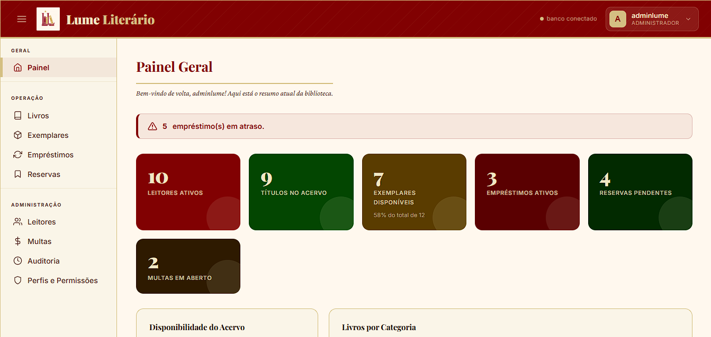
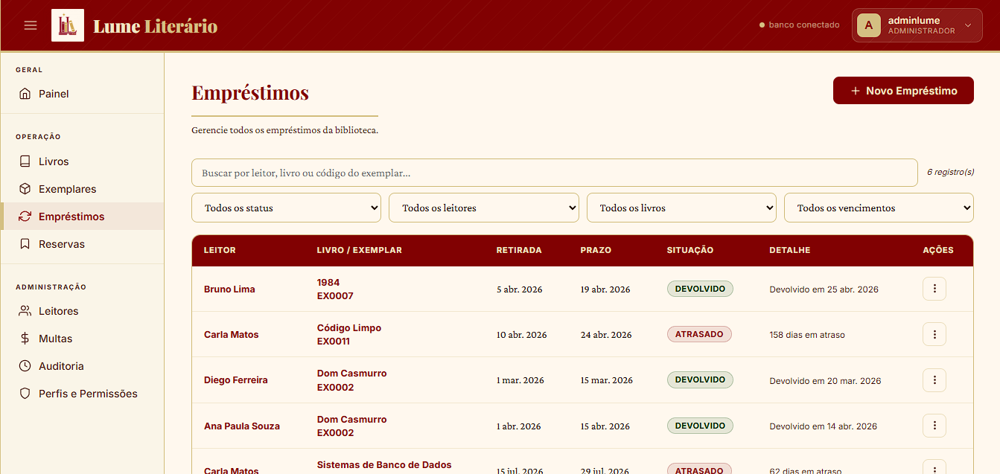
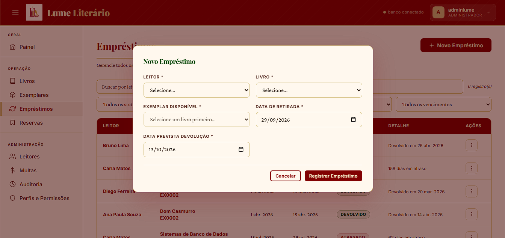

<div align="center">
  

# Lume Literário

**Sistema de gestão de biblioteca:** software para administrar acervo, usuários, empréstimos, reservas e multas.

`PostgreSQL` · `Supabase` · `Edge Functions (Deno/TypeScript)` · `HTML/CSS/JS`
</div>

---

## Sobre o projeto

O **Lume Literário** é um sistema de gestão de bibliotecas construído sobre o Supabase
(PostgreSQL). Ele centraliza o cadastro do acervo e dos usuários e automatiza o ciclo de
empréstimos, incluindo reservas com fila, cálculo de multas por atraso e relatórios.

A regra principal do projeto: **“primeiro um sistema de gestão, depois uma biblioteca”**, o foco
é confiabilidade, organização e segurança dos dados.

## Funcionalidades

- **Acervo:** livros, autores (N:N), editoras, categorias e exemplares físicos.
- **Usuários:** cadastro com validação de CPF, inativação/reativação (soft-delete).
- **Empréstimos:** registro, devolução transacional e atualização automática do status do exemplar.
- **Reservas:** fila por livro (posição calculada), atendida automaticamente na devolução.
- **Multas:** geradas por atraso, com valor calculado pelo banco e registro de pagamento.
- **Painel:** indicadores e relatório de empréstimos em atraso.
- **Autenticação** e **trilha de auditoria** de todas as operações de escrita.

## Telas

| Login                                        | Painel geral                                                           |
| -------------------------------------------- | ---------------------------------------------------------------------- |
|  |  |

| Empréstimos                                                                      | Novo empréstimo                                                        |
| -------------------------------------------------------------------------------- | ---------------------------------------------------------------------- |
|  |  |

> Dados fictícios, usados apenas para demonstração.

## Arquitetura

Arquitetura em camadas: o navegador **nunca** acessa o banco diretamente:

```
Navegador (apresentação)
   │   index.html + css/ + js/ (config, util, auth, api, repositories, services, ui, app)
   ▼
API (Supabase Edge Function "api")          ← valida sessão, regras de negócio, chave de serviço
   │   supabase/functions/api/index.ts
   ▼
Banco de dados (PostgreSQL no Supabase)      ← RLS, views, funções, triggers, procedure
       db/schema.sql
```

- **Front-end** só cuida da interface; as queries não conhecem o schema.
- **API** é a única porta de escrita/leitura: valida a sessão do usuário, executa com a chave de
  serviço (nunca exposta) e centraliza as regras (CPF, disponibilidade, datas, devolução…).
- **Banco** com integridade referencial (FKs com ações), RLS restrito a usuários autenticados,
  colunas de auditoria, views de relatório e a procedure transacional de devolução.

## Estrutura de pastas

```
.
├── index.html                 # marcação da aplicação
├── css/styles.css             # estilos
├── js/                        # camadas do front-end
│   ├── config.js              # conexão e estado
│   ├── util.js                # utilitários e helpers de UI
│   ├── auth.js                # autenticação (Supabase Auth)
│   ├── api.js                 # cliente único da API
│   ├── repositories.js        # leitura (via API)
│   ├── services.js            # escrita (via API)
│   ├── ui.js                  # renderização e handlers
│   └── app.js                 # inicialização e gate de login
├── supabase/functions/api/    # back-end (Edge Function)
│   └── index.ts
├── db/schema.sql              # estrutura completa do banco (reprodutível)
├── assets/                    # logos e imagens
├── BRAND_README.md            # guia de marca
└── README.md
```

## Como rodar

**Pré-requisitos:** uma conta no [Supabase](https://supabase.com) e um servidor web local.

1. **Clone o repositório.**
2. **Banco:** crie um projeto no Supabase e rode o conteúdo de `db/schema.sql` no SQL Editor.
3. **Back-end:** publique a Edge Function (a própria função valida a sessão):
   ```bash
   supabase functions deploy api --no-verify-jwt
   ```
4. **Usuário:** crie um usuário em _Authentication → Users_ (ex.: `adminlume@lume.local`).
   No login, basta digitar o nome de usuário (o domínio é completado automaticamente).
5. **Front-end:** em `js/config.js`, ajuste `SUPA_URL` e `SUPA_KEY` (a chave **anônima** do projeto).
6. **Sirva os arquivos** (não abra via `file://` — use um servidor):
   ```bash
   python -m http.server 8000
   ```
   Acesse `http://localhost:8000`.

## Segurança

- **Sem acesso direto ao banco:** os papéis `anon` e `authenticated` não têm privilégio algum
  nas tabelas/views (`/rest/v1` não devolve dados). Tudo passa pela Edge Function; o RLS fica
  ligado como segunda camada.
- **Cadastro público desligado:** contas da equipe são criadas pelo admin. Uma conta sem perfil
  em `app_perfil` é recusada pela API (403) — não existe mais auto-cadastro como `consulta`.
- **Chave de serviço** vive apenas no servidor (Edge Function), nunca no navegador. A chave
  `anon` no front é pública por design.
- **Auditoria:** toda operação de escrita é registrada em `log_auditoria`.

> Para produção, ative a _proteção contra senha vazada_ no Supabase e use senhas fortes.

## Desenvolvimento e CI/CD

```bash
npm install          # eslint + prettier
npm run lint         # análise estática
npm run format:check # checagem de formatação (Prettier)
npm test             # testes (node --test)
```

- **CI** (`.github/workflows/ci.yml`): roda lint + formato + testes em todo push e PR para `main`/`staging`.
- **Deploy** (`.github/workflows/deploy.yml`): push em `staging` publica no projeto Supabase de homologação; push em `main`, no de produção. Aplica migrations (`supabase db push`) e republica a Edge Function `api`.
- **Banco versionado:** migrations em `supabase/migrations/` (baseline + incrementos). `db/schema.sql` é a versão legível completa.
- Fluxo de branches, segredos e padrões em [`CONTRIBUTING.md`](CONTRIBUTING.md).

## Perfis de acesso (RBAC)

Três papéis, definidos em `app_perfil` e aplicados pela Edge Function:

- **leitor** — somente consulta;
- **bibliotecário** — operações do dia a dia (acervo, empréstimos, reservas, multas);
- **admin** — tudo + gestão de papéis.

Como atribuir papéis e trocar a senha do admin: ver [`OPERATIONS.md`](OPERATIONS.md).

## Roadmap

**Concluído:** paginação e busca **no servidor**; Git + CI/CD (GitHub Actions) + homologação; **perfis de acesso** (admin/bibliotecário/leitor); testes + lint/format + **build** (esbuild); **observabilidade** de erros (`log_erro`).

**Ações de painel pendentes** (em [`OPERATIONS.md`](OPERATIONS.md)): ativar proteção contra senha vazada (HIBP) + senha forte; validar backup/PITR e alertas.

**Banco:** PKs em **UUID** e nomenclatura **snake_case** (B6) — migration `20260613020000`, valide em staging (ver [`OPERATIONS.md`](OPERATIONS.md)).

**Evolução futura:** front em framework/SPA. Detalhes em `Auditoria_Tecnica_Lume_Literario.md`.

## Licença

Distribuído sob a licença MIT. Veja [`LICENSE`](LICENSE).
